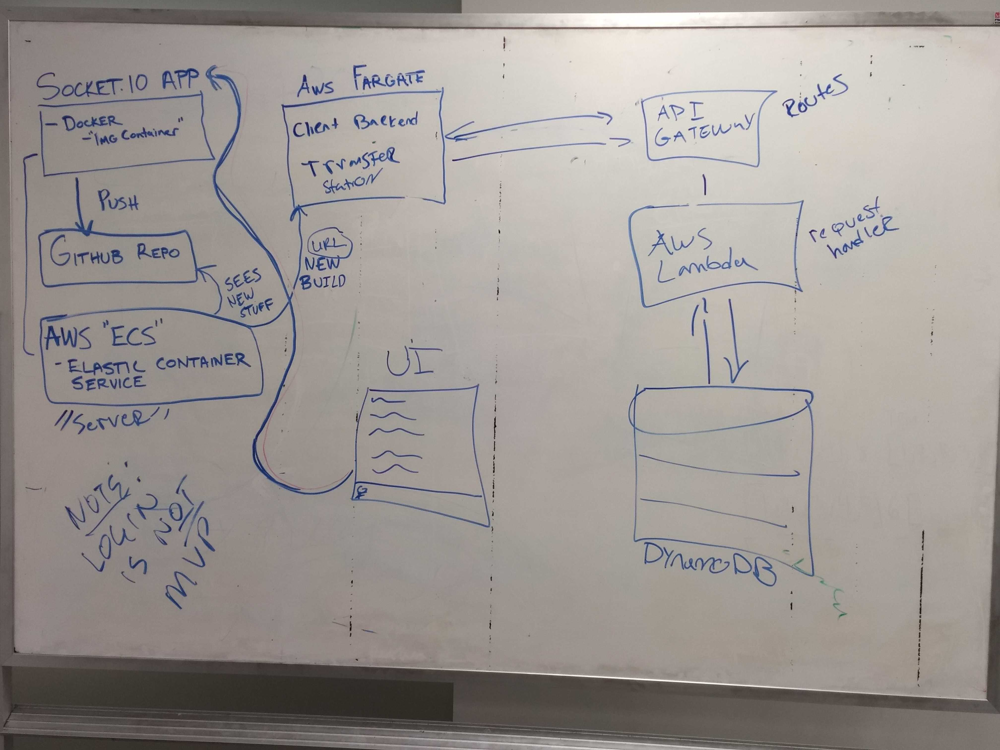

# eFMRL Chat Persistence Layer

eFMRL is a Socket.io chat application using React & React Native based clients and AWS infrastructure for both the server layer and the persistence layer.

### Resources
Persistence Layer uses Node.js, AWS-SDK, DynamoDB, serverless Lambda functions, and routes exposed via AWS API Gateway

### Installation
1. Fork and clone this repo
2. Make sure you have AWS creds: https://serverless-stack.com/chapters/create-an-aws-account.html
3. Install serverless CLI: https://serverless.com/framework/docs/getting-started/
4. In the AWS console, create the DynamoDB table as described here: https://serverless-stack.com/chapters/create-a-dynamodb-table.html (our table is differently named and has different fields and keys so see the code)
5. deploy via serverless CLI (example: https://serverless-stack.com/chapters/deploy-the-apis.html)
6. Successful deploy will supply URLs for the various API routes. Some examples for how to exercise the routes via the cURL command line tool: (examples: https://serverless.com/blog/serverless-express-rest-api/)

### Notes
This implementation follows this tutorial: https://serverless-stack.com and includes a serverless starter kit which we didn't necessarily need for this implementation.

